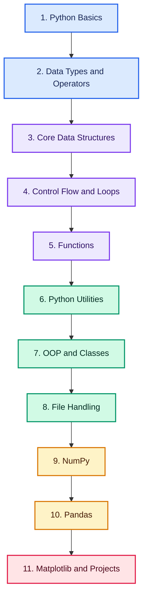

# python-roadmap
# Python Roadmap: From Beginner to Data-Ready Python Developer

> A complete, structured learning path covering Python fundamentals, data types, control flow, functions, OOP, file handling, NumPy, Pandas, and Matplotlib

## Quick Roadmap

**Foundations:** [Python Basics](#python-basics) • [Data Types](#data-types) • [Operators](#operators) • [Control Flow](#python-if-else)

**Core Data Structures:** [Lists](#lists) • [Tuples](#tuples) • [Sets](#sets) • [Dictionaries](#dictionaries)

**Build Skills:** [Functions](#python-functions) • [Python Utilities](#python-utilities) • [OOP & Classes](#python-classes--oop) • [File Handling](#file-handling)

**Data Science Stack:** [NumPy](#numpy) • [Pandas](#pandas) • [Matplotlib](#matplotlib) • [Portfolio Projects](#portfolio-projects)

**Career Path:** [16-Week Learning Plan](#16-week-balanced-learning-plan) • [Interview Preparation](INTERVIEWS.md) • [Contributing Guide](CONTRIBUTING.md)

## Why Learn Python?

Python is one of the most versatile and in-demand programming languages, powering everything from web apps and automation scripts to data science and machine learning pipelines. Learning it opens doors to software development, data analysis, and AI engineering roles.

## Build Job-Ready Python Skills

Go beyond theory and learn how to:

- Write clean, idiomatic Python code
- Work confidently with lists, tuples, sets, and dictionaries
- Build reusable functions, decorators, and generators
- Apply object-oriented programming principles
- Read, write, and manage files
- Analyze and manipulate data with NumPy and Pandas
- Visualize data with Matplotlib
- Build portfolio projects and prepare for interviews

> **Learn the concepts. Build real projects. Become job-ready.**

Follow the roadmap in order, starting with Python fundamentals before moving into data structures, functions, OOP, file handling, and the data science stack.

## Complete Learning Path

### Python Basics

- [Introduction](https://dev.tech.examadda.org/python/python-introduction)
- [Installation](https://dev.tech.examadda.org/python/python-installation)
- [Syntax](https://dev.tech.examadda.org/python/python-syntax)
- [Output](https://dev.tech.examadda.org/python/python-output)
- [Comments](https://dev.tech.examadda.org/python/python-comments)

- Variables

  - [Variables](https://dev.tech.examadda.org/python/python-tutorialpython-tutorial)
  - [Variable Names](https://dev.tech.examadda.org/python/python-tutorialpython-tutorial)
  - [Assign Multiple Values](https://dev.tech.examadda.org/python/assign-multiple-values)
  - [Output Variables](https://dev.tech.examadda.org/python/output-variables)
  - [Global Variables](https://dev.tech.examadda.org/python/python-global-and-local-variables)

---

### Data Types

- [Data Types](https://dev.tech.examadda.org/python/python-data-types)
- [Numbers](https://dev.tech.examadda.org/python/python-numeric-datatype)
- [Casting](https://dev.tech.examadda.org/python/python-type-casting)
- [Booleans](https://dev.tech.examadda.org/python/python-booleans)

- Strings

  - [Slicing Strings](https://dev.tech.examadda.org/python/python-string-slicing)
  - [Modify Strings](https://dev.tech.examadda.org/python/python-modify-strings)
  - [String Concatenation](https://dev.tech.examadda.org/python/python-string-concatenation)
  - [Format Strings](https://dev.tech.examadda.org/python/python-f-strings)
  - [Escape Characters](https://dev.tech.examadda.org/python/python-escape-characters)
  - [String Methods](https://dev.tech.examadda.org/python/python-string-methods)
  - [String Exercises](https://dev.tech.examadda.org/python/python-string-exercises)

---

### Operators

- [Arithmetic Operators](https://dev.tech.examadda.org/python/python-arithmetic-operators)
- [Assignment Operators](https://dev.tech.examadda.org/python/python-assignment-operators)
- [Comparison Operators](https://dev.tech.examadda.org/python/python-comparison-operators)
- [Logical Operators](https://dev.tech.examadda.org/python/python-logical-operator)
- [Identity Operators](https://dev.tech.examadda.org/python/python-identity-operator)
- [Membership Operators](https://dev.tech.examadda.org/python/python-membership-operator)
- [Bitwise Operators](https://dev.tech.examadda.org/python/python-bitwise-operator)
- [Operator Precedence](https://dev.tech.examadda.org/python/operator-precedence)

---

### Lists

- [Access List Items](https://dev.tech.examadda.org/python/access-list-items)
- [Change List Items](https://dev.tech.examadda.org/python/change-list-items)
- [Add List Items](https://dev.tech.examadda.org/python/add-list-items)
- [Remove List Items](https://dev.tech.examadda.org/python/remove-list-items)
- [Loops](https://dev.tech.examadda.org/python/loop-lists)
- [List Comprehension](https://dev.tech.examadda.org/python/list-comprehension)
- [List Methods](https://dev.tech.examadda.org/python/list-methods)

---

### Tuples

- [Access Tuple Items](https://dev.tech.examadda.org/python/access-tuple-items)
- [Update Tuple Items](https://dev.tech.examadda.org/python/update-tuple-items)
- [Packing and Unpacking of Tuples](https://dev.tech.examadda.org/python/packing-and-unpacking-of-tuples)
- [Loop Tuples](https://dev.tech.examadda.org/python/loop-tuples)
- [Join Tuples](https://dev.tech.examadda.org/python/join-tuples)
- [Tuple Methods](https://dev.tech.examadda.org/python/tuple-methods)

---

### Sets

- [Access Set Items](https://dev.tech.examadda.org/python/access-set-items)
- [Add Set Items](https://dev.tech.examadda.org/python/add-set-items)
- [Remove Set Items](https://dev.tech.examadda.org/python/remove-set-items)
- [Loop Sets](https://dev.tech.examadda.org/python/loop-sets)
- [Join Sets](https://dev.tech.examadda.org/python/join-sets)
- [Frozen Sets](https://dev.tech.examadda.org/python/frozen-sets)
- [Set Methods](https://dev.tech.examadda.org/python/set-methods)

---

### Dictionaries

- [Access Dictionary Items](https://dev.tech.examadda.org/python/access-dictionary-items)
- [Change Dictionary Items](https://dev.tech.examadda.org/python/change-dictionary-items)
- [Add Dictionary Items](https://dev.tech.examadda.org/python/add-dictionary-items)
- [Remove Dictionary Items](https://dev.tech.examadda.org/python/remove-dictionary-items)
- [Loop Dictionary Items](https://dev.tech.examadda.org/python/loop-dictionary-items)
- [Copy Dictionaries](https://dev.tech.examadda.org/python/copy-dictionary-items)
- [Nested Dictionaries](https://dev.tech.examadda.org/python/nested-dictionaries)
- [Dictionary Methods](https://dev.tech.examadda.org/python/dictionary-methods)

---

### Python If Else

- [Python If](https://dev.tech.examadda.org/python/if-statements)
- [Python Elif](https://dev.tech.examadda.org/python/elif-statement)
- [Python Else](https://dev.tech.examadda.org/python/else-statement)
- [Python Shorthand If](https://dev.tech.examadda.org/python/shorthand-if)
- [Python Nested If](https://dev.tech.examadda.org/python/nested-if)
- [Python Pass Statement](https://dev.tech.examadda.org/python/pass-statement)

---

### Python Loops

- [Python Match](https://dev.tech.examadda.org/python/match-statement)
- [Python For Loops](https://dev.tech.examadda.org/python/for-loops)
- [Python While Loops](https://dev.tech.examadda.org/python/while-loops)
- [Python Jump Statements](https://dev.tech.examadda.org/python/jump-statements)

---

### Python Functions

- [Functions Introduction](https://dev.tech.examadda.org/python/functions-introduction)
- [Python Arguments](https://dev.tech.examadda.org/python/function-arguments)
- [Python *args / **kwargs](https://dev.tech.examadda.org/python/python-args_wargs)
- [Python Scope](https://dev.tech.examadda.org/python/function-scope)
- [Python Decorators](https://dev.tech.examadda.org/python/decorators)
- [Python Lambda](https://dev.tech.examadda.org/python/lambda)
- [Python Recursions](https://dev.tech.examadda.org/python/recursion)
- [Python Generators](https://dev.tech.examadda.org/python/generators)

---

### Python Utilities

- [Python Range](https://dev.tech.examadda.org/python/python-range)
- [Python Iterators](https://dev.tech.examadda.org/python/python-iterators)
- [Python Modules](https://dev.tech.examadda.org/python/python-modules)
- [Python Dates](https://dev.tech.examadda.org/python/python-dates)
- [Python Math](https://dev.tech.examadda.org/python/python-math)
- [Python JSON](https://dev.tech.examadda.org/python/python-json)
- [Python Regex](https://dev.tech.examadda.org/python/python-regex)
- [Python PIP](https://dev.tech.examadda.org/python/python-pip)
- [Python Try Except](https://dev.tech.examadda.org/python/try-except)
- [Python String Formatting](https://dev.tech.examadda.org/python/string-formatting)
- [Python None](https://dev.tech.examadda.org/python/python-none)
- [Python User Input](https://dev.tech.examadda.org/python/user-input)
- [Python Virtual Environment](https://dev.tech.examadda.org/python/virtual-environment)

---

### Python Classes & OOP

- [Python OOP](https://dev.tech.examadda.org/python/python-oop)
- [Classes / Objects](https://dev.tech.examadda.org/python/classes-and-objects)
- [__init__ Method](https://dev.tech.examadda.org/python/__init__method)
- [Self Parameter](https://dev.tech.examadda.org/python/self-parameter)
- [Class Properties](https://dev.tech.examadda.org/python/class-properties)
- [Class Methods](https://dev.tech.examadda.org/python/class-methods)
- [Static Methods](https://dev.tech.examadda.org/python/static-methods)
- [Inheritance](https://dev.tech.examadda.org/python/python-inheritance)
- [Encapsulation](https://dev.tech.examadda.org/python/python-encapsulation)
- [Polymorphism](https://dev.tech.examadda.org/python/python-polymorphism)
- [Abstraction](https://dev.tech.examadda.org/python/python-abstraction)
- [Interfaces](https://dev.tech.examadda.org/python/python-interfaces)
- [Composition vs Inheritance](https://dev.tech.examadda.org/python/composition-vs-inheritance)
- [Nested Classes](https://dev.tech.examadda.org/python/nested-classes)

---

### File Handling

- [Python File Handling](https://dev.tech.examadda.org/python/file-handling)
- [Read Files](https://dev.tech.examadda.org/python/read-files)
- [Write/Create Files](https://dev.tech.examadda.org/python/write-files)
- [Delete Files](https://dev.tech.examadda.org/python/delete-files)

---

### NumPy

- [NumPy Introduction](https://dev.tech.examadda.org/python/numpy-introduction)
- [Creating Arrays](https://dev.tech.examadda.org/python/creating-arrays)
- [Array Indexing](https://dev.tech.examadda.org/python/array-indexing)
- [Array Slicing](https://dev.tech.examadda.org/python/array-slicing)
- [NumPy DataTypes](https://dev.tech.examadda.org/python/data-types)
- [Copy vs View](https://dev.tech.examadda.org/python/copy-vs-view)
- [Array Shape](https://dev.tech.examadda.org/python/array-shape)
- [Array Iterating](https://dev.tech.examadda.org/python/array-iteration)
- [Array Join](https://dev.tech.examadda.org/python/array-join)
- [Array Split](https://dev.tech.examadda.org/python/array-split)
- [Array Search](https://dev.tech.examadda.org/python/array-search)
- [Array Sort](https://dev.tech.examadda.org/python/numpy-sort)
- [Array Filter](https://dev.tech.examadda.org/python/numpy-filter)
- [NumPy Random](https://dev.tech.examadda.org/python/numpy-random)
- [NumPy ufunc](https://dev.tech.examadda.org/python/numpy-ufunc)
- [NumPy Broadcasting](https://dev.tech.examadda.org/python/numpy-broadcasting)
- [Linear Algebra](https://dev.tech.examadda.org/python/numpy-linear-algebra)
- [Statistics Functions](https://dev.tech.examadda.org/python/numpy-statistics-functions)

---

### Pandas

- [Pandas Introduction](https://dev.tech.examadda.org/python/pandas-introduction)
- [Pandas Series](https://dev.tech.examadda.org/python/pandas-series)
- [Pandas DataFrames](https://dev.tech.examadda.org/python/pandas-dataframe)
- [Read CSV](https://dev.tech.examadda.org/python/pandas-read-csv)
- [Read JSON](https://dev.tech.examadda.org/python/pandas-read-json)
- [Analyzing Data](https://dev.tech.examadda.org/python/pandas-analyzing-data)
- [Cleaning Data](https://dev.tech.examadda.org/python/pandas-cleaning-data)
- [Cleaning Empty Cells](https://dev.tech.examadda.org/python/pandas-cleaning-empty-cells)
- [Cleaning Wrong Format](https://dev.tech.examadda.org/python/pandas-cleaning-wrong-format)
- [Cleaning Wrong Data](https://dev.tech.examadda.org/python/pandas-cleaning-wrong-data)
- [Removing Duplicates](https://dev.tech.examadda.org/python/pandas-removing-duplicates)
- [Correlations](https://dev.tech.examadda.org/python/pandas-correlations)

---

### Matplotlib

- [Matplotlib Introduction](https://dev.tech.examadda.org/python/matplotlib-introduction)
- [Matplotlib Pyplot](https://dev.tech.examadda.org/python/matplotlib-pyplot)
- [Matplotlib Plotting](https://dev.tech.examadda.org/python/matplotlib-plotting)
- [Matplotlib Markers](https://dev.tech.examadda.org/python/matplotlib-markers)
- [Matplotlib Line](https://dev.tech.examadda.org/python/matplotlib-line-plot)
- [Matplotlib Labels](https://dev.tech.examadda.org/python/matplotlib-labels)
- [Matplotlib Grid](https://dev.tech.examadda.org/python/matplotlib-grid)
- [Matplotlib Subplot](https://dev.tech.examadda.org/python/matplotlib-subplots)
- [Matplotlib Scatter](https://dev.tech.examadda.org/python/matplotlib-scatter-plot)
- [Matplotlib Bars](https://dev.tech.examadda.org/python/matplotlib-bar-chart)
- [Matplotlib Histograms](https://dev.tech.examadda.org/python/matplotlib-histogram)
- [Matplotlib Pie Charts](https://dev.tech.examadda.org/python/matplotlib-pie-chart)

---

## Portfolio Projects

Build practical projects that demonstrate real-world Python skills.

| Level | Project | Core Skills | Deliverables |
|:---:|---|---|---|
| 🟢 Beginner | Command-Line Calculator | Operators, functions, control flow | Script, README, tests |
| 🟢 Beginner | To-Do List App | Lists, dictionaries, file handling | CLI app, saved data file |
| 🟡 Intermediate | Contact Book | OOP, file handling, JSON | CRUD app, data persistence |
| 🟡 Intermediate | CSV Data Cleaner | Pandas, data cleaning | Cleaned dataset, script |
| 🟡 Intermediate | Web Scraper | Modules, requests, regex | Data export, README |
| 🟠 Advanced | Data Analysis Dashboard | Pandas, NumPy, Matplotlib | Notebook, visual report |
| 🟠 Advanced | REST API Client | Functions, error handling, JSON | Reusable client library |
| 🔴 Expert | Inventory Management System | OOP, encapsulation, file handling | Full CLI/GUI application |
| 🔴 Expert | Automated Report Generator | Pandas, Matplotlib, scheduling | Scheduled report pipeline |
| 🔴 Expert | Mini Data Science Toolkit | NumPy, Pandas, Matplotlib | Packaged Python library |

## Interview Preparation

Prepare for Python interviews with structured, level-based practice.

For structured preparation, follow the complete [Python Interview Preparation Guide](INTERVIEWS.md).

Focus on data structures, mutability vs immutability, OOP principles, decorators and generators, exception handling, file I/O, and practical NumPy/Pandas/Matplotlib usage.

## 16-Week Balanced Learning Plan

| Weeks | Learning Focus | Milestone |
|:---:|---|---|
| 1–2 | Python basics, syntax, and variables | Simple script project |
| 3–4 | Data types, strings, and operators | String utility toolkit |
| 5–6 | Lists, tuples, sets, and dictionaries | Data structure mini project |
| 7–8 | Conditional statements, loops, and functions | Command-line calculator |
| 9 | Python utilities (modules, regex, JSON, exceptions) | Utility scripts collection |
| 10–11 | OOP and classes | Contact book / inventory app |
| 12 | File handling | Data persistence project |
| 13–14 | NumPy and Pandas | CSV data cleaner |
| 15 | Matplotlib | Data visualization report |
| 16 | Capstone and interview revision | Live demo, README, and case study |

> Complete each milestone as a documented GitHub project to build an interview-ready portfolio.

## Contributing

Corrections, explanations, test cases and implementations are welcome. Read [CONTRIBUTING.md](CONTRIBUTING.md) before opening a pull request.

## About ExamAdda

[ExamAdda](https://examadda.org) is an all-in-one platform for mastering DSA, system design, development skills, and coding interviews through structured courses, hands-on practice, company-wise questions, and mock interviews.

**Learn smarter. Practice consistently. Crack top tech interviews.**

[Start Learning](https://dev.tech.examadda.org/) • [Explore Courses](https://examadda.org/courses/) • [Unlock ExamAdda Premium](https://examadda.org/premium)

## License

This repository is available under the [MIT License](LICENSE).
